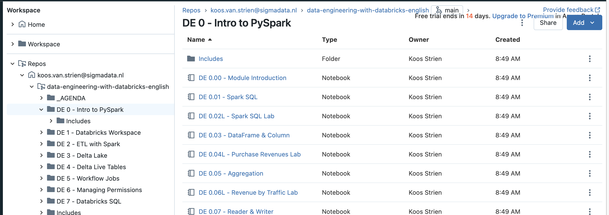

# Data Engineering with Databricks

## Setup

* Set up an Azure Databricks environment inside Azure.
  * Use trail capacity (14 days free DBU's)
* Add a personal compute cluster
  * Inside your Azure Databricks workspace, go to **Compute** in the left hand menu
  * Click the blue **Create compute** button
  * Change the **policy** to **Personal Compute**
  * Change **Terminate after** to **240 minutes** (4 hours)
  * Click **Create Cluster**
* Load the course materials
  * Select **Workspace** in the left hand menu
  * Click **Repos**
  * Click **Add Repo**, and enter the following details:
    * **Git repository URL**: `https://github.com/wortell-smart-learning/data-engineering-with-databricks-english.git`
  * Click **Create Repo**

The repository is now available within your Azure Databricks environment

## Structure

The course is structured in 8 modules, each consisting of several lessons. For example:

* Module 0: Intro to PySpark
  0. Introduction: Module Introduction
  1. Demo: Spark SQL
  2. Lab: Spark SQL Lab
  3. (...)
* Module 1 - Databricks Workspace
  * (...)
* (...)

Inside the repository browser, open the folder with the first module by clicking on it. The contents on the folder will show up on the right hand side of the window:

All Python files inside the repository are available right here as Databricks Notebooks. If you open up the first notebook ("Module introduction") you will see the contents of the entire module introduced to you inside a notebook.